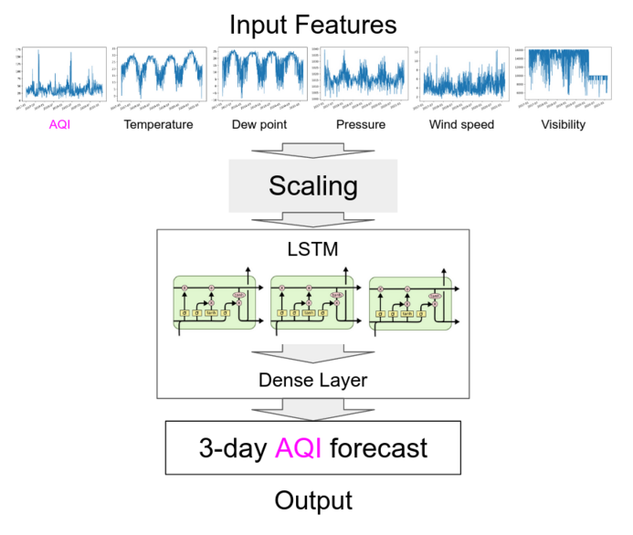
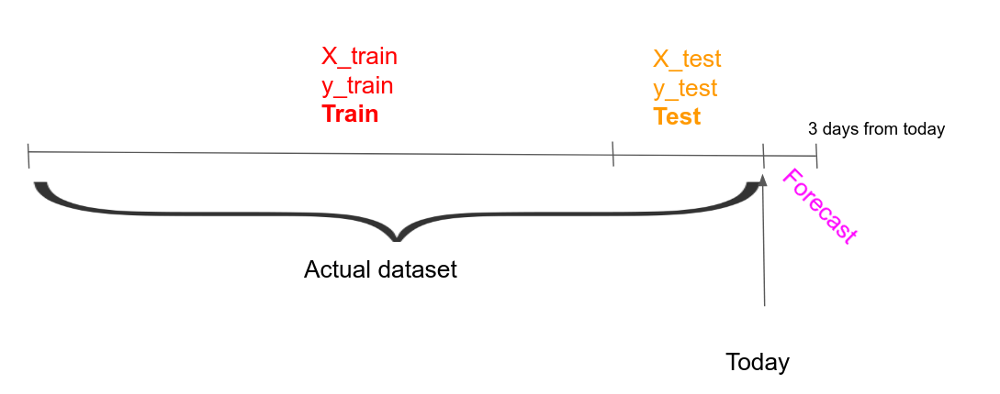

# Houston Air Pollution Forecast

## Motivation

## Overview

## Results

https://www.airnow.gov/aqi/aqi-calculator/

0.01 MSE loss inverse transformed into roughly 4 AQI points

## Tech stack

- Python 3
- Jupyter Notebook - for testing purposes
- OpenCV - for creating the categories
- Tensorflow Keras API - for making the forecasts
- NumPy - manipulating arrays
- Streamlit - hosting and frontend 

## Dataset Used

The data I used to train this model was very reliable. I coalesced two different datasets provided by the [NOAA](https://www.noaa.gov/) (National Oceanic and Atmospheric Administration) and the [TCEQ](https://www.tceq.texas.gov/) (Texas Commision on Environmental Quality).

[NOAA's dataset](https://www.dolthub.com/repositories/Liquidata/noaa) came from DoltHub, which I downloaded and converted to CSV. It contained meterological weather data from over thirteen different weather stations strategically placed in Houston. These were the features I used to feed into the model.

[TCEQ's dataset](https://www.tceq.texas.gov/cgi-bin/compliance/monops/peak_monthly.pl?override) is only an online tabular dataset. I had to webscrape the values into a CSV so I could parse and feed into the model. It provides data over 60 weather stations in Houston. The AQI value is what the model is trying to predict. 

## Obstacles

The main problems I faced while completing this project was the frontend and the limited usage of the meterological weather APIs. I elaborate more [here.](docs/Reflection.md)