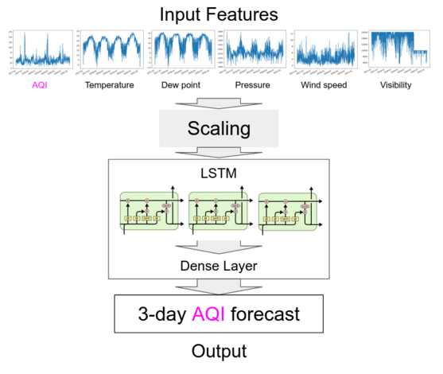

# Houston Air Pollution Forecast

## Motivation

AQI is just a way to measure air pollution, and its value can fall in 6 different categories.


## Overview

Usually with forecasts, meteorologists analyze trends on a map because it is much easier for a human that way. But machines can easily interpret rows of data much better than any human can. 

I wanted to see if weather (temperature, dew point humidity, pressure, wind speed, & visibility) had a correlation with air pollution, and make a forecast for AQI based on that. My reason was that they should have a general increaing trend due to global warming, and that definitely affects the AQI levels.



Since the features contain a wide set of values, we scale the data to fit between 0 and 1. This reduces the disparity and makes the training faster.

GRU beat LSTM in terms of loss by a little for the reccurrent part of the network.

In the end there is a dense layer with shape 1 to output the AQI value.

The frontend was done with streamlit & streamlit components. Someone (link at the very bottom) implemented leaflet map API into a streamlit component, so I just used that. The user clicks on their desired area in Houston and a forecast pops up for that area. 

## Results

The average MSE loss was 0.1, scaled. This translated into roughly 4 AQI points after an inverse transformation. In other words, the model had a prediction accuracy of plus or minus 4 AQI points.


## Run

```
cd src/frontend/streamlit-light-leaflet/my_component/frontend/
npm install
npm run start

cd ../../../..
streamlit run app.py
```

## Tech stack

- Python 3
- Jupyter Notebook - for testing purposes
- OpenCV - for creating the categories
- Tensorflow Keras API - for making the forecasts
- NumPy - manipulating arrays
- Streamlit - hosting and frontend 

## Dataset Used

The data I used to train this model was very reliable. I coalesced two different datasets provided by the [NOAA](https://www.noaa.gov/) (National Oceanic and Atmospheric Administration) and the [TCEQ](https://www.tceq.texas.gov/) (Texas Commision on Environmental Quality).

[NOAA's dataset](https://www.dolthub.com/repositories/Liquidata/noaa) came from DoltHub, which I downloaded and converted to CSV. It contained meterological weather data from over thirteen different weather stations strategically placed in Houston. These were the features I used to feed into the model.

[TCEQ's dataset](https://www.tceq.texas.gov/cgi-bin/compliance/monops/peak_monthly.pl?override) is only an online tabular dataset. I had to webscrape the values into a CSV so I could parse and feed into the model. It provides data over 60 weather stations in Houston. The AQI value is what the model is trying to predict. 

The dataset was split into train and test in chonological order for training the model and seeing how it preformed with data never it never saw before. Once the loss was satisfactory, the models were ready to deploy for forecasting.


## Obstacles

The main problems I faced while completing this project was the frontend and the limited usage of the meterological weather APIs. I elaborate more [here.](docs/Reflection.md)

## Useful links

- Tensorflow Time-Series Prediction Tutorial: https://github.com/Hvass-Labs/TensorFlow-Tutorials/blob/master/23_Time-Series-Prediction.ipynb
- Interactive map Streamlit component: https://github.com/andfanilo/streamlit-light-leaflet
- Streamlit demo: https://github.com/streamlit/demo-uber-nyc-pickups