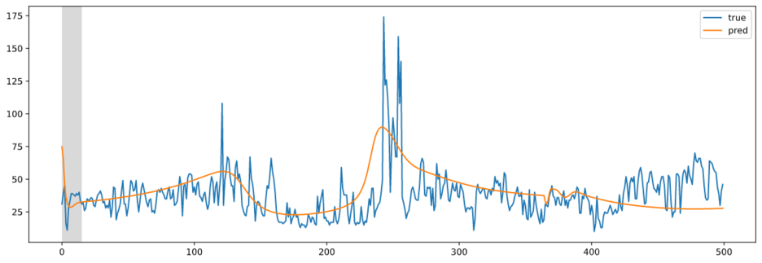
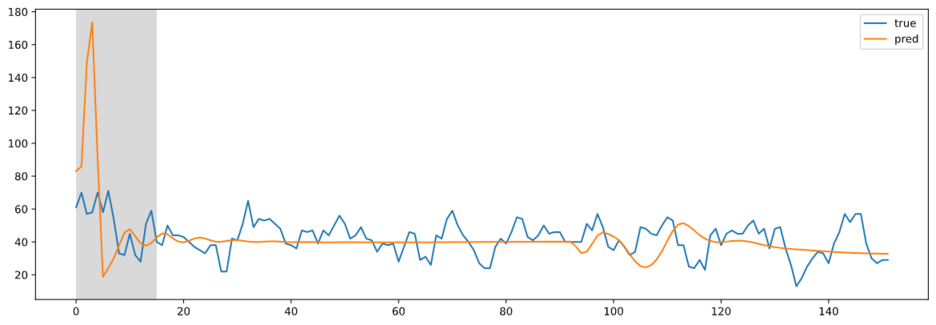
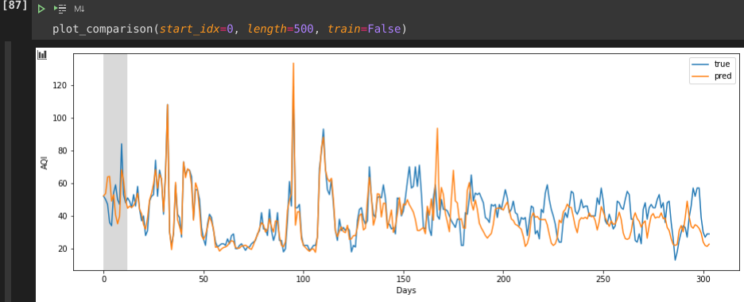

# Reflection 

## Date

10th grade, 2021. From February to April, mostly. After those days it was just bug squashing and documenting. 

This was the topic for a video competition. I didn't have time to edit the video to the fullest because I was so preoccupied with finishing this project on time. But I still won a prize.

## Overview

I chose a LSTM model at first because, as the name implies, the model would take care of the long-term and short-term trends. The short-term trend in this scenario would be the fluctuation in AQI levels on the daily. For example, AQI levels during the week may be higher due to car pollution commuting to work, compared to AQI levels during the weekends. The long-term trend would be the gradual increase in AQI due to global warming. A model that takes into consideration both perspectives would be ideal. But in the end, I went with a GRU because it outperformed the LSTM by a little. There wasn't that much of a difference.

## Obstacles I faced

### Bad Results

At first I tried only using the date as the input feature for the model, no weather values, no nothing. The result was not satisfactory.

Training:

Testing:

My goal was for the model to forecast the smaller daily fluctuations of the AQI. But the graphs were really smooth and not enough variation. Using the weather features as inputs lead to a phenomenal improvement, as you can see in the graph below (especially during the testing section). 

A wider range of input features lead to the prediction of peaks in the AQI during the testing phase.

### API Limits

I needed weather APIs to fetch today's weather data to feed into my model to then predict the AQI. However, I could only use the free tiers of these API services, such as openweatherapi and weathernow. Even the ones that had free trial expired after some time. Plus, some of the weather values that were returned were not as specific as I had envisioned. And in order to have AQI predictions, I would need a basic weather forecast to feed into the model. All the APIs that I used only allowed up to three days into the future, not the seven-day forecast I had hoped. Therefore, my AQI forecasts were only limited to three days in the future.

### Bad Data

As I mentioned in the README, I had to fuse two datasets while making sure all the dates lined up. I failed to consider that the weather features had different units in each dataset. As a result, this resulted in a dataset error with the visibility values. I had to drop visibility as an input feature because the disparity was too big and it might've affected the output.

It's bummer because I think visibility would've been a very important feature, because air pollution and levels of visibility are obviously correlated.

### Frontend

I am not a frontend guy. At first, I made a very nice UI for the website with simple HTML/CSS, but there were plenty of issues. The UI I made was not responsive at all, plus the fact that I was now limited to a three day forecast changed the number of boxes I needed. So I tried rearranging the boxes that had the AQI predictions in them but I could't, and it really frustrated me. The final and most important issue is that I had a hard time sending data from the frontend to the backend and vice versa. I did not have any expertise in this field and I didn't have much time to finish and edit my video for the competition, so I had to make a quick streamlit alternative.

I find streamlit much easier to work with than HTML/CSS, but it is also much more limited. The boxes I had to make with OpenCV because frontend HTML/CSS had frustrated me already. I ended up deleting my index.html file and lost all my progress.

## What I liked

## What I learned

- Time Series Predicting
- GRU/LSTM/RNN implementations in TensorFlow

## Improvements

Better frontend